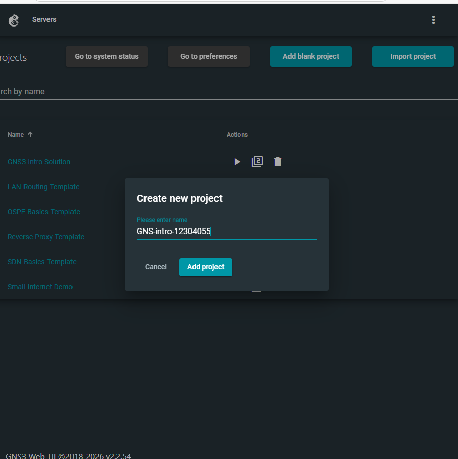

# TCP/IP Assessment using GNS3

## Student Details
**Name:** Miheer Ghimire  
**Student ID:** 12304055  
**Course:** COIT12206  
**Term:** 2026 T1  

## Project Overview
Project demonstrates a basic TCP/IP network setup using GNS3. A host device was configured with a static IP address and tested through the GNS3 Web UI console.

## Objective
- Understand TCP/IP configuration
- Create a GNS3 project
- Configure host network settings
- Apply static IP addressing

## Tools Used
- GNS3
- VirtualBox
- GNS3 Web Interface
- GitHub

## Network Configuration
- IP Address: 10.10.1.1  
- Subnet Mask: 255.255.255.0  
- Gateway: 192.168.0.1  
- DNS: 192.168.0.1  

## Configuration Code
```bash
auto eth0
iface eth0 inet static
    address 10.10.1.1
    netmask 255.255.255.0
#   gateway 192.168.0.1
up echo nameserver 192.168.0.1 > /etc/resolv.conf


---
```md
## Screenshots

### Project Creation


### Topology View


### Host Configuration


### Console Output

