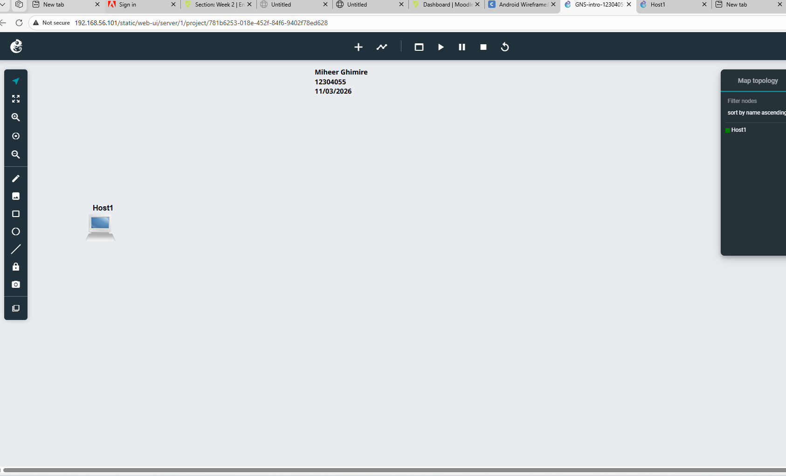

##WEEK 1
## Project Overview
This project shows a simple TCP/IP network configuration with GNS3. A host machine was configured with a static IP address and tested using the GNS3 Web UI console.

## Objective are:
- Understand TCP/IP configuration
- Create and develop a GNS3 project
- Configure or set host network settings configurations
- Apply and use static IP addressing

## Tools Used
- VirtualBox
- GNS3 and Web Interface
- GitHub

## Network Configuration Setting 
-  10.10.1.1 used as IP Address
- Subnet Mask: 255.255.255.0
- Gateway : 192.168.0.1
- DNS: 192.168.0.1

## Configuration Code
```bash
auto eth0
iface eth0 inet static
    address 10.10.1.1
    netmask 255.255.255.0
#   gateway 192.168.0.1
    up echo nameserver 192.168.0.1 > /etc/resolv.conf

```
## Screenshots of GNS Project

### Project Creation of GNS 


### Topology of Week 1 View


### Host 1  Configuration Setting


### Console Output of host 1 


## Project Reflection of  TCP/IP Configuration using GNS3

This project allowed me to understand TCP/IP configuration setting  in a realistic and practical way. Although I was already familiar with the theoretical concepts, actually configuring and setting up a network in GNS3 made everything clearer.

Whereas manually setting up a static IP address, also help to understand how devices communicate or connect within the same network. 

Overall, working with GNS3 project help me to  gain me hands-on experience in building and managing network topologies, which help me  engaging and helped to connect theoretical as well as  knowledge with real-world applications.

---

## Key Concepts Learned

- **TCP/IP Configuration Setting**  
  Understanding how IP address, gateway, subnet mask, and DNS work together.

- **Static IP **  
  Provides consistency but must be configured.

- **Subnetting**  
 network divides and host portions of an IP address.

- **Gateway**  
  For accessing external networks.

- **Domain Name System**  
  Converts domain names into IP addresses in the system.

- **GNS3**  
  Powerful tool, which used for simulating real-world network environments without any physical hardware.
