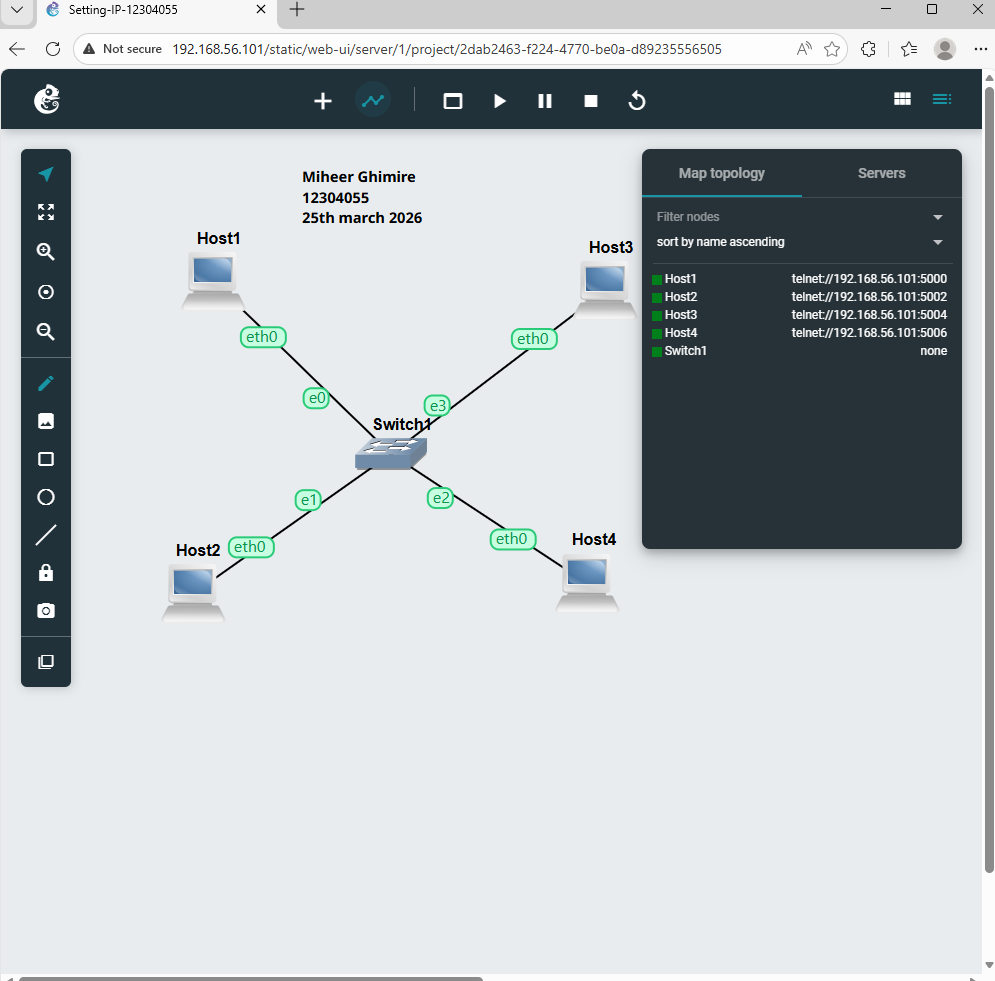
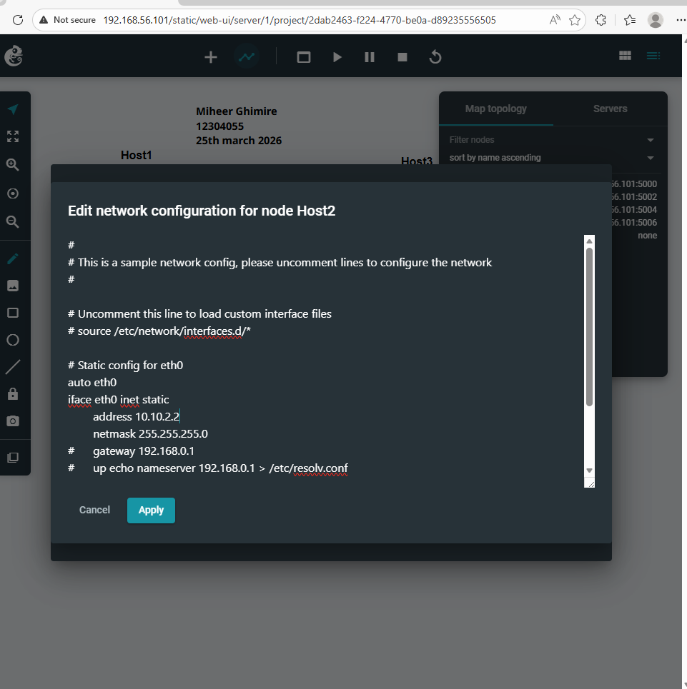
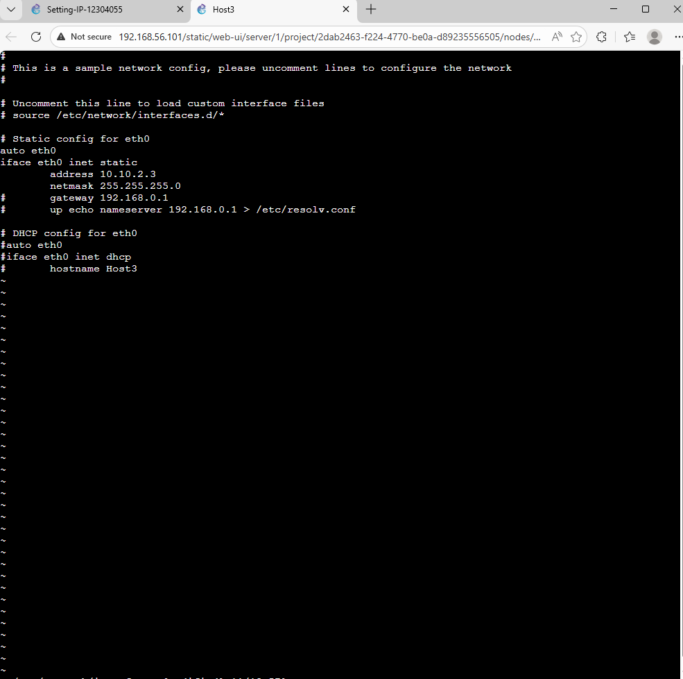
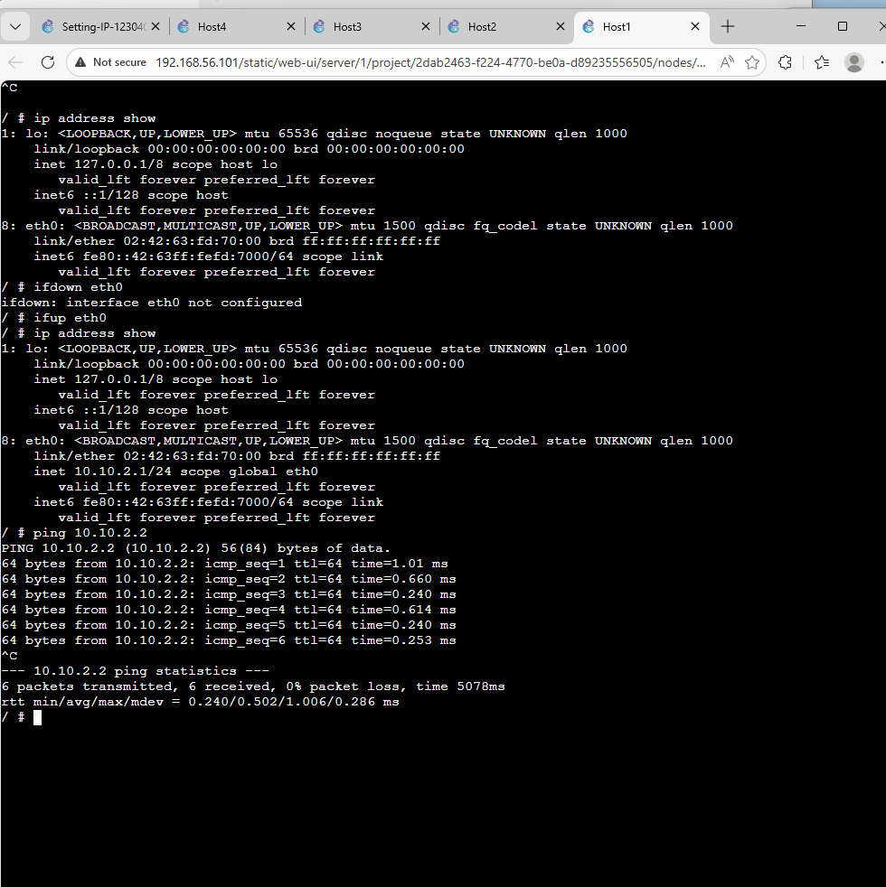
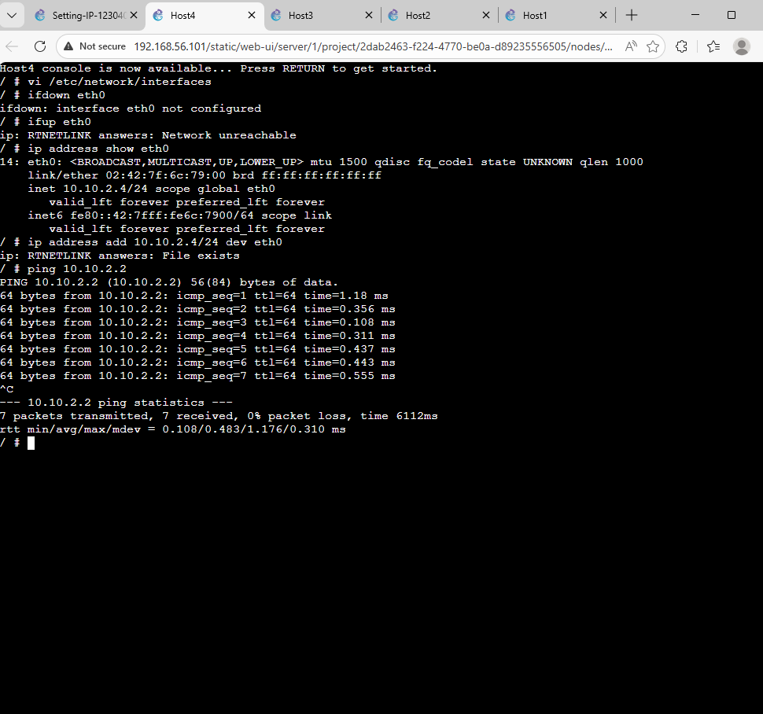

# WEEK 2- Portfolio

## Course
**COIT12206 – TCP/IP Principles and Protocols**

## Student Details
- **Name:** Miheer Ghimire 
- **Student ID:** 12304055
- **Term:** 2026 Term 1  

---

## Week 2: Project Overview

This week 2 project presents a TCP/IP network topology in GNS3 with multiple hosts linked to each other with the help of one switch. Each of the hosts will be set to a static IP and tested connectivity through ping command.


---

## Network Topology of Week 2
- Used 4 Hosts (Host1, Host2, Host3, Host4)
- Used 1 Switch
- Star topology connection

---

## IP Configuration

| Host  | IP Address |
|------|-----------|
| Host1 | 10.10.2.1 |
| Host2 | 10.10.2.2 |
| Host3 | 10.10.2.3 |
| Host4 | 10.10.2.4 |

Subnet Mask: 255.255.255.0

---

## Configuration Code

```bash
auto eth0
iface eth0 inet static
    address 10.10.2.X
    netmask 255.255.255.0
    up echo nameserver 192.168.0.1 > /etc/resolv.conf
```

---

## Screenshots

### Topology of Week 2 


---
### Host 1 Configuration Screenshot:


---
### Host 2 Configuration Screenshot:


---
### Setting IP Address of Host 1:


---
### Setting IP Address of Host 2:


---
### Setting IP Address of Host 3:


---
### Setting IP Address of Host 4:


---
### Console of Host 3:


---
### Console of Host 4:


---
### Ping Test Command (Successfully ping between Host1 to Host2):


---
### Ping Test (Successfully ping between Host4 to Host2):


---
### Ping Test (Failure in pinging):


---
###  Reflection
Activity help me to understand how the TCP/IP configuration in a practical way. By assigning with static IP addresses manually.

During testing, I noticed that correct configuration setting is very important. A small mistake can cause communication failure.

Overall, observing both successful and failed ping output helped me understand how network connectivity works using GNS3, which made the learning process more interactive and helped me connect theory with real-world networking.

---

### Key Concepts:
- Setteing of TCP/IP configuration and communication between devices  
- Value of static IP assignment  
- Subnet mask in defining the network  
- Ping command is used for testing connectivity  
- Practical use of GNS3   
