# COIT12206 – TCP/IP Principles and Protocols Portfolio

## Student Details
- **Name:** Miheer Ghimire
- **Student ID:** 12304055

## Portfolio Contents
This repository contains my practical work and evidence for COIT12206.

### Weeks Included
- **Week 4** – View Routing Tables and Dynamic Routing with OSPF

## Tools Used
- GNS3
- Linux networking commands
- FRRouting (FRR)
- GitHub

## Repository Structure
- `Week-4/` – Task 1 and Task 2 files, screenshots, and explanation

---

# Task 1 – View Routing Tables

## Objective
This task demonstrates how to configure a small routed network using Linux hosts and a Linux router, enable forwarding on the router, view routing tables, and verify connectivity between two subnets.

## Network Topology
The network contains:
- Host1 and Host2 on subnet `10.10.1.XY/24`
- Host3 on subnet `10.10.2.XY/24`
- Router connecting both subnets
- One switch connecting Host1, Host2, and the router interface on subnet A

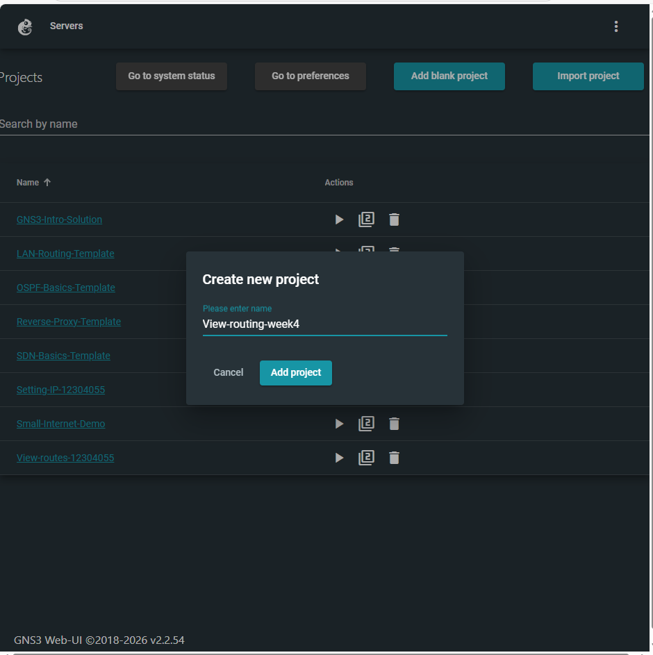
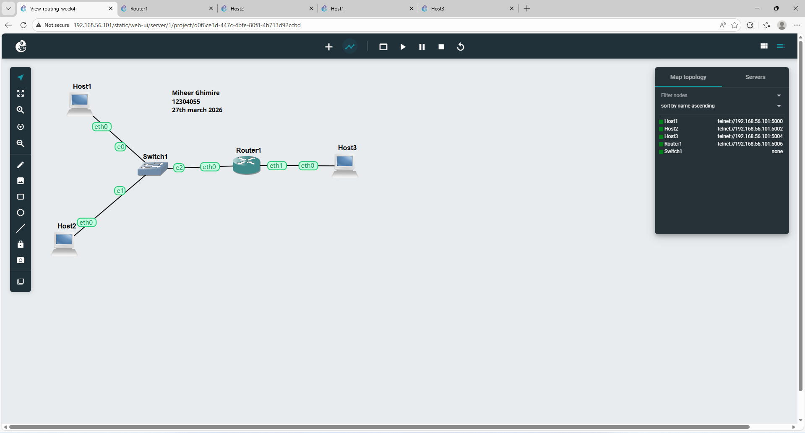

## IP Addressing Used

| Device | Interface | IP Address | Netmask | Gateway |
|---|---|---:|---:|---:|
| Host1 | eth0 | 10.10.1.11 | 255.255.255.0 | 10.10.1.1 |
| Host2 | eth0 | 10.10.1.12 | 255.255.255.0 | 10.10.1.1 |
| Host3 | eth0 | 10.10.2.11 | 255.255.255.0 | 10.10.2.1 |
| Router | eth0 | 10.10.1.1 | 255.255.255.0 | – |
| Router | eth1 | 10.10.2.1 | 255.255.255.0 | – |

## Configuration Evidence

### Router Configuration

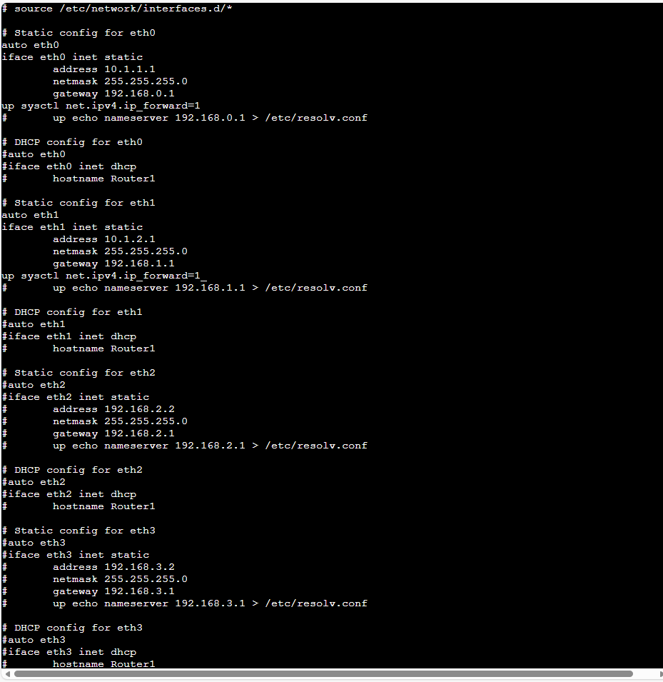

### Host1 Configuration
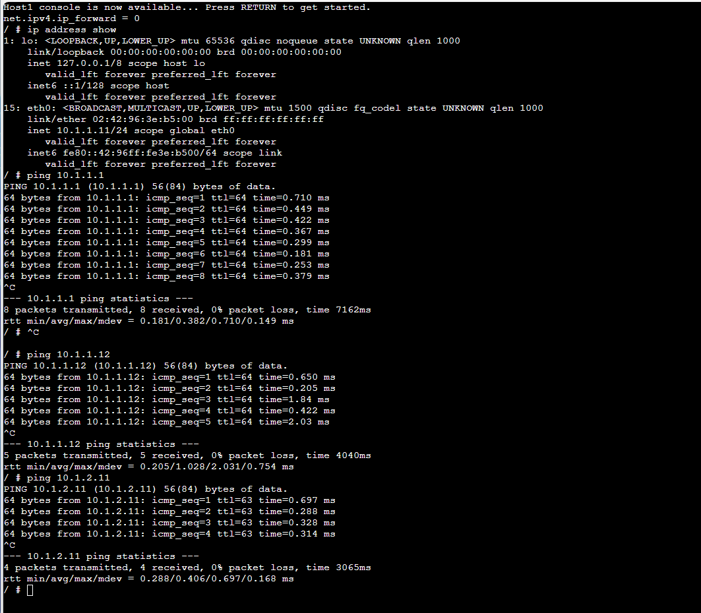

### Host2 Configuration
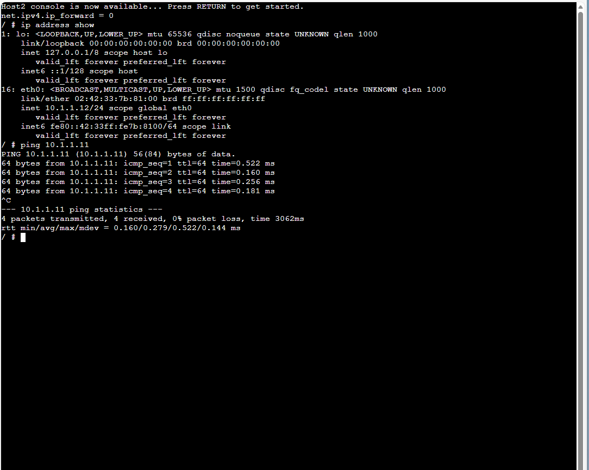

### Host3 Configuration
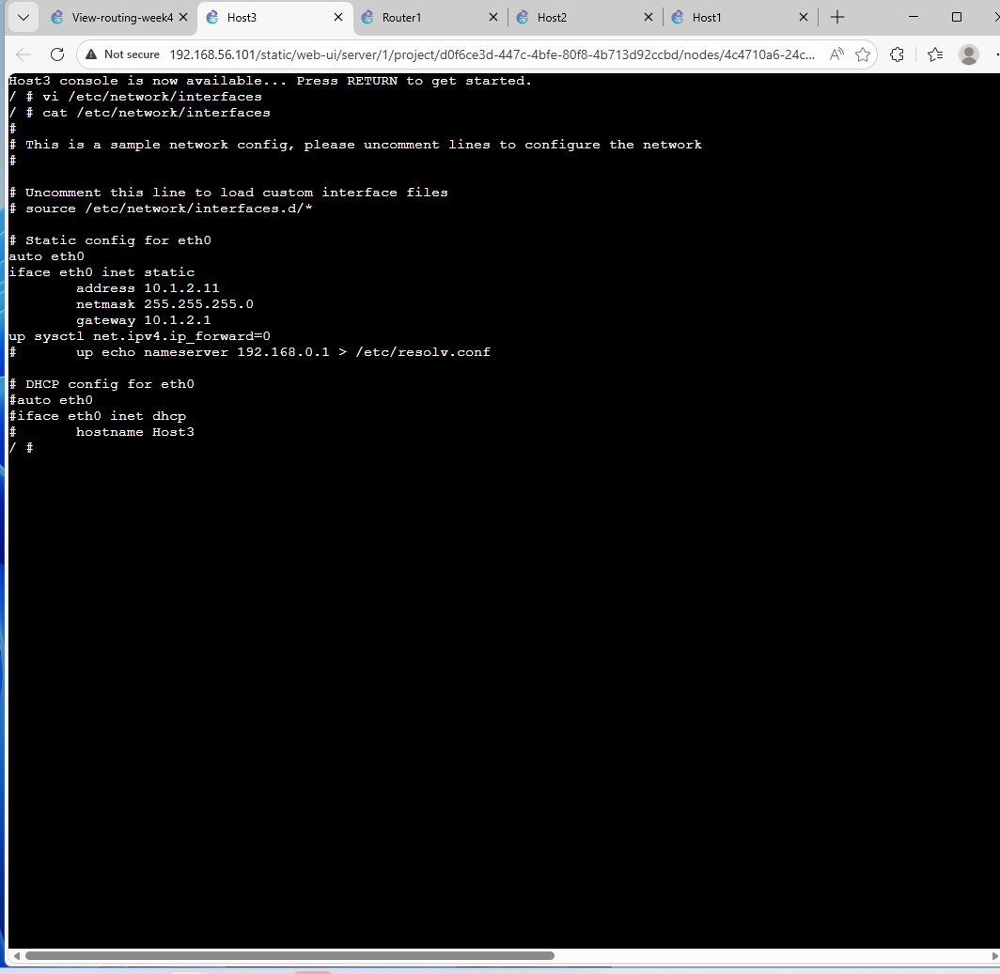

## Forwarding
- Forwarding was disabled on hosts.
- Forwarding was enabled on the router so it could route packets between the two subnets.

## Routing Table Evidence

### Router Routing Table

## Connectivity Test
A successful ping from Host1 to hosts and router addresses shows that routing worked correctly across subnets.

### Host1 Ping Results

## Summary
Task 1 was completed by:
1. Building a two-subnet topology
2. Assigning static IP addresses
3. Enabling forwarding on the router
4. Viewing routing tables
5. Confirming communication between subnets with ping

---

# Task 2 – Dynamic Routing with OSPF

## Objective
This task demonstrates how OSPF dynamically shares routes between FRR routers and how the path changes automatically after a link failure.

## OSPF Topology
The topology contains:
- Host1 on network `10.10.1.0/24`
- Host2 on network `10.10.6.0/24`
- FRR1, FRR2, FRR3, and FRR4
- Two possible paths between the hosts
- NETem nodes used to simulate path failure

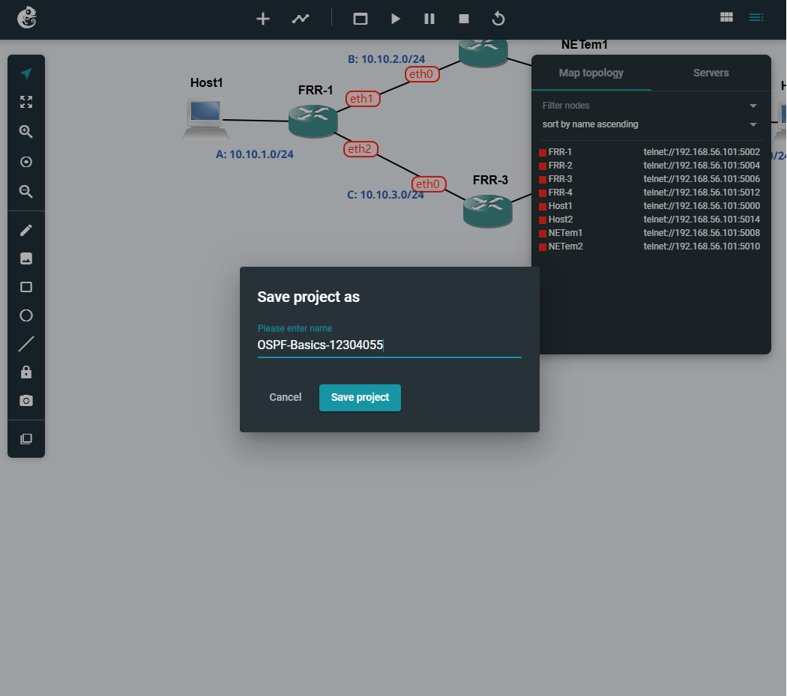

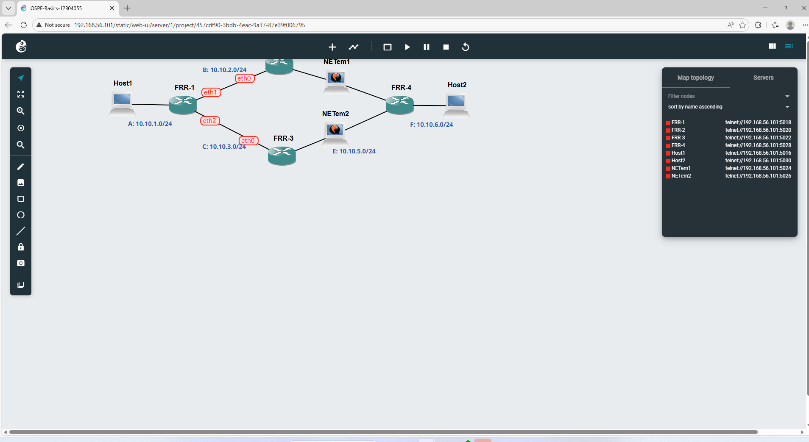

## OSPF Verification

### OSPF Neighbor Output
This confirms that FRR1 formed OSPF adjacencies with neighboring routers.

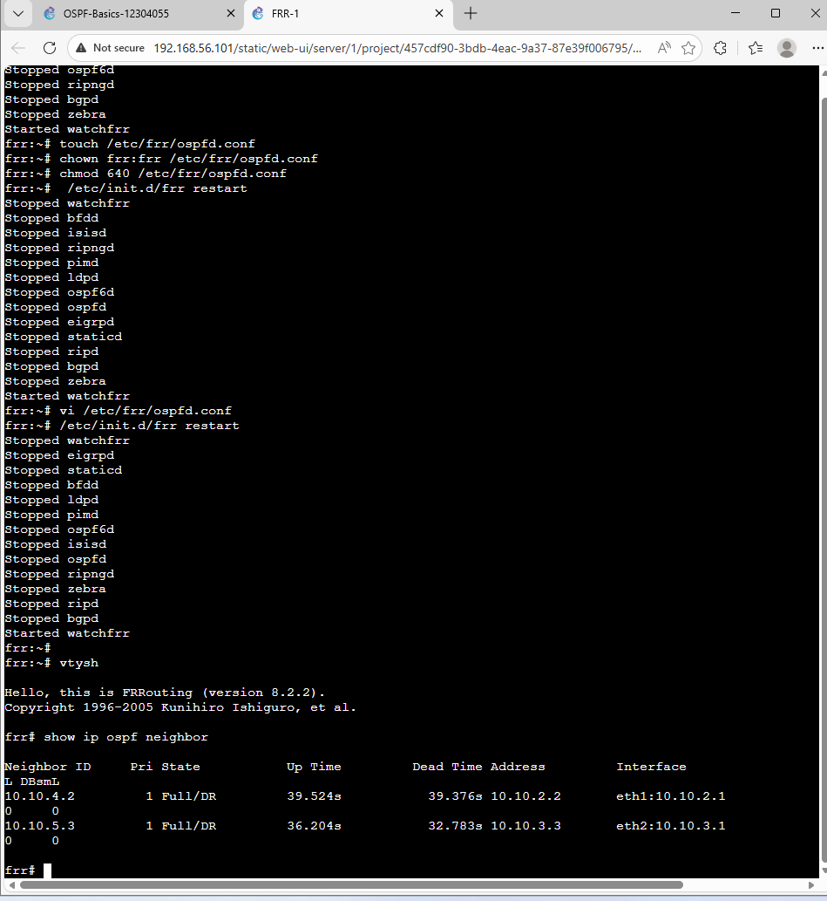

### IP Route Table
This shows the routes installed in the router forwarding table.

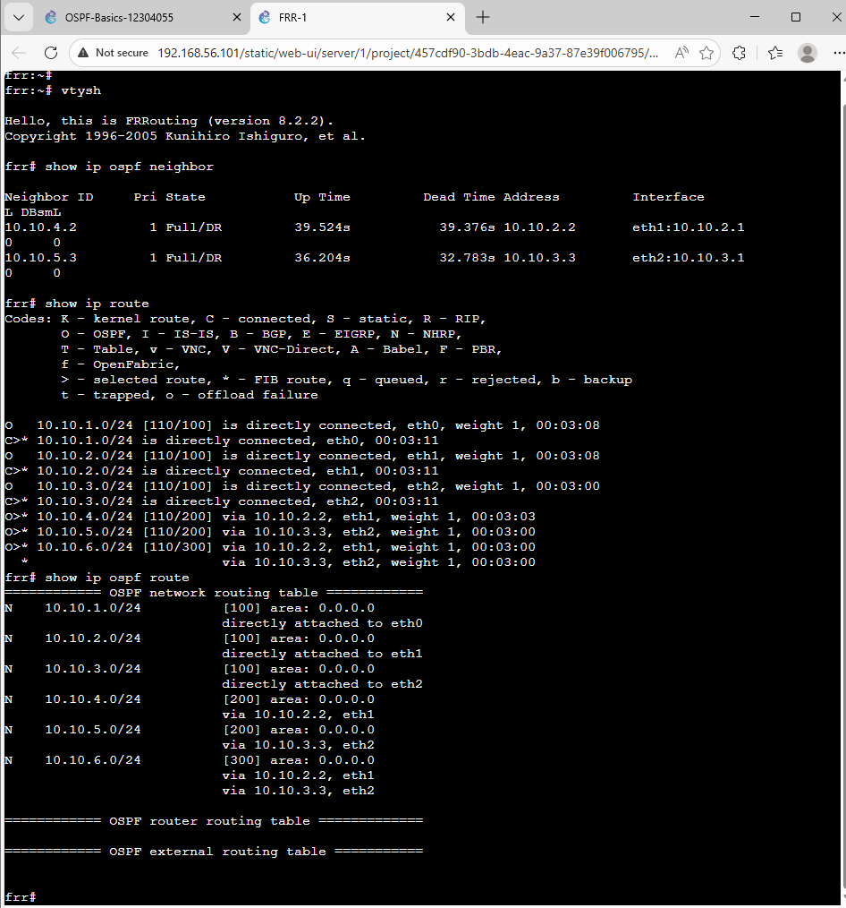

### Ho

## Traceroute Before Link Failure
Before disconnecting the path, traceroute from Host1 to Host2 followed the current preferred route.
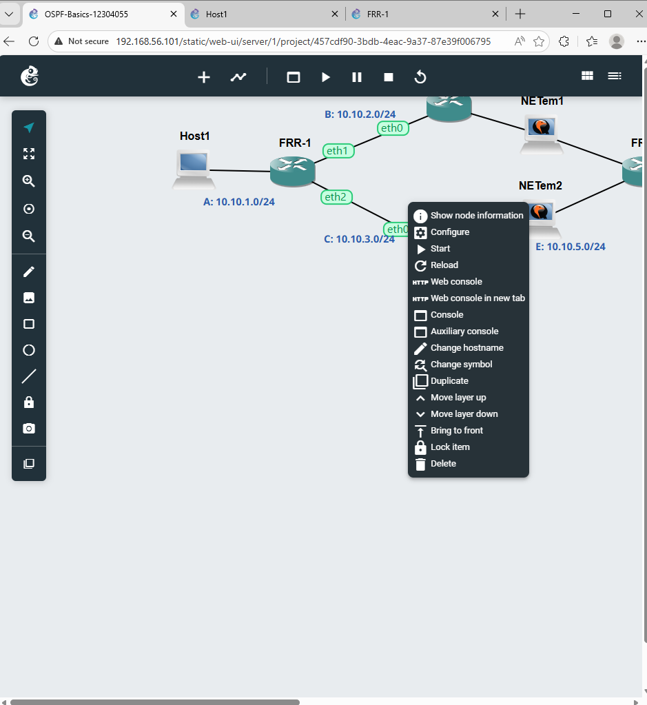
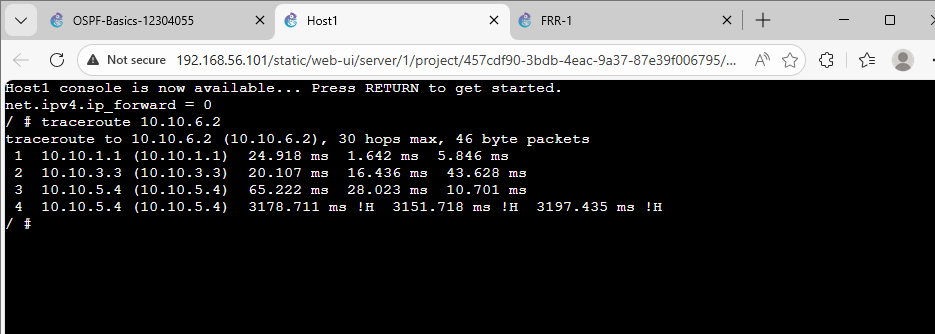

## Traceroute After Link Failure
After stopping the relevant NETem node, the route changed and traffic used the alternate path.

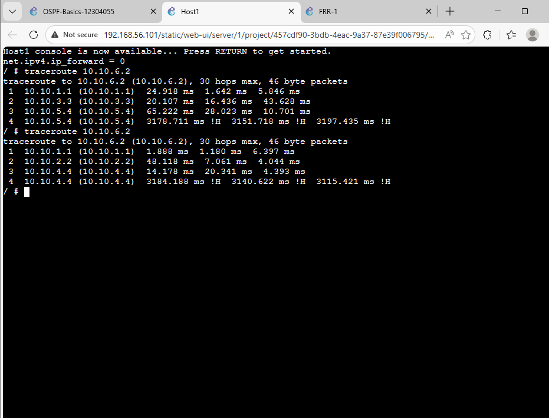

## Routing Summary Table

| Router | Destination Network | Next Node / Interface |
|---|---|---|
| FRR1 | 10.10.1.0/24 | directly connected (eth0) |
| FRR1 | 10.10.2.0/24 | directly connected (eth1) |
| FRR1 | 10.10.3.0/24 | directly connected (eth2) |
| FRR1 | 10.10.4.0/24 | via 10.10.2.2 |
| FRR1 | 10.10.5.0/24 | via 10.10.3.3 |
| FRR1 | 10.10.6.0/24 | via 10.10.2.2 or 10.10.3.3 depending on topology state |

## Key Observation
OSPF automatically updated the path after a link failure. This shows why dynamic routing is useful in larger networks: it reduces manual reconfiguration and adapts to topology changes.

## Conclusion
Week 4 successfully demonstrated:
- Static routing concepts and routing table viewing in Task 1
- OSPF neighbor establishment and dynamic route learning in Task 2
- Automatic path change when a link became unavailable
