# WEEK 5 -Portfolio

## Course
**COIT12206 – TCP/IP Principles and Protocols**

## Student Details
- **Name:** Miheer Ghimire  
- **Student ID:** 12304055 
- **Term:** 2026 Term 1  

---
#  Week 5 Project Overview:

This week 5 project illustrates the VLAN configuration and inter-VLAN routing using Open vSwitch and also a Linux Router in GNS3.

Two tasks were performed in this week:

* Task 1: VLAN configuration and network isolation
* Task 2: Inter-VLAN communication with a router.

  **Objective:**
   This task involves configuring a VLAN on Switch.
---
#  Task 1: VLAN Configuration on Switch Screenshot:
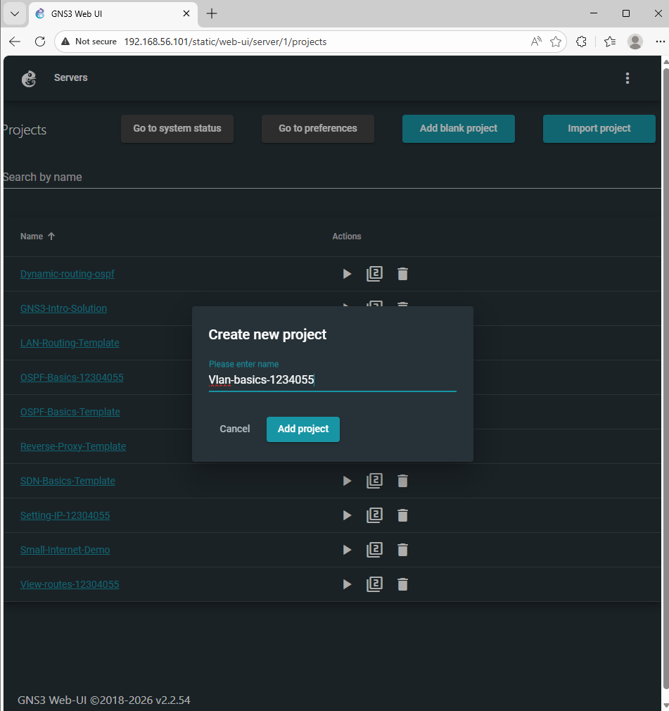

---
##  Network Topology of VlAN configuration on switch:

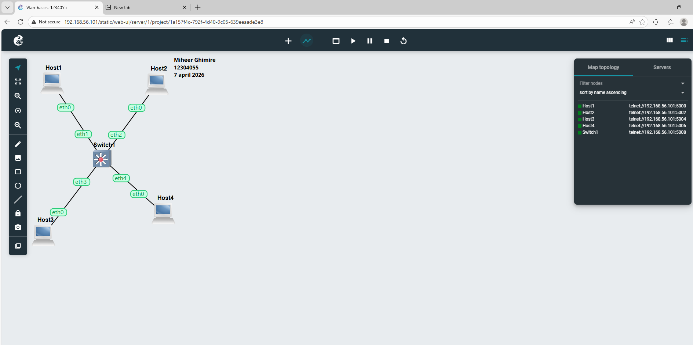

Topology shows 4 hosts connected to a switch without a router.

---

## Configuration made up in Week 5:

* Host1 : 10.10.1.101
* Host2 : 10.10.1.102
* Host3 : 10.10.1.103
* Host4 : 10.10.1.104

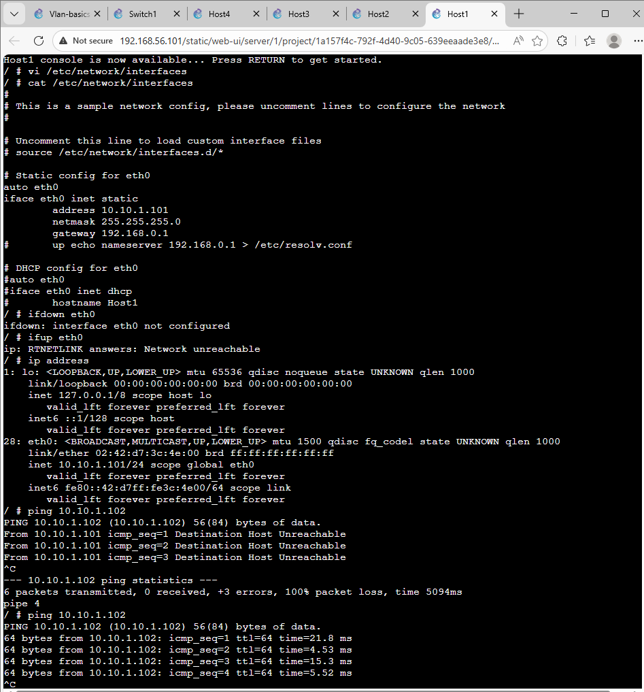
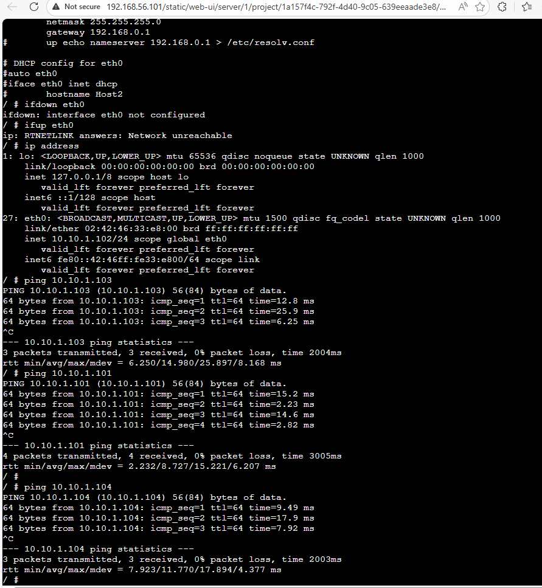
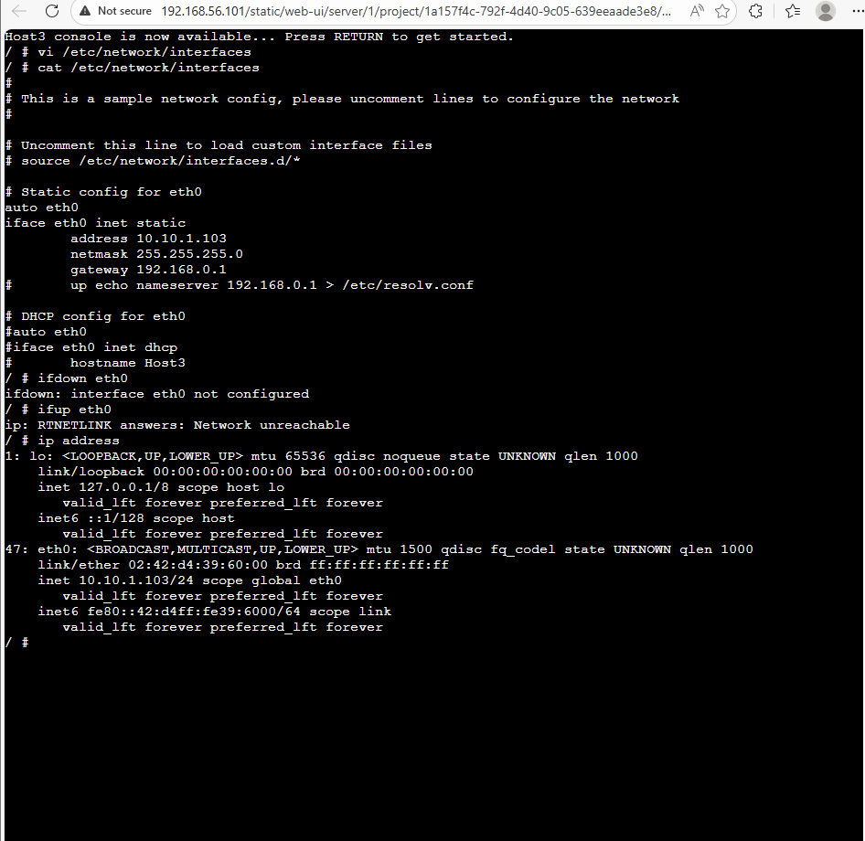


---

### VLAN Setup Screenshot:
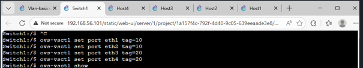
```
ovs-vsctl set port eth1 tag=10
ovs-vsctl set port eth2 tag=10
ovs-vsctl set port eth3 tag=20
ovs-vsctl set port eth4 tag=20
```

 VLAN 10 → (Host 1 and  Host 2)
 VLAN 20 → (Host 3 and Host 4)

---

## Switch Configuration Screenshot:

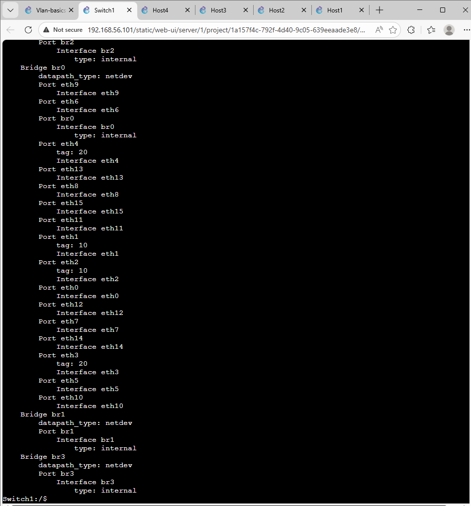

Which shows VLAN tagging with switch ports on Open vSwitch.

---

## Ping Connectivity Testing:

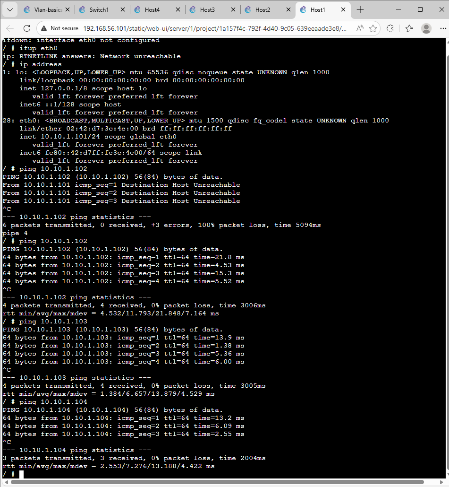


1. Within VLANs, ping testing is successful.
2. Different VLAN = reslut ping fails (Isolation functioning)

---
##  ARP Observation:


* Same VLAN → MAC resolved

* Different VLAN → incomplete
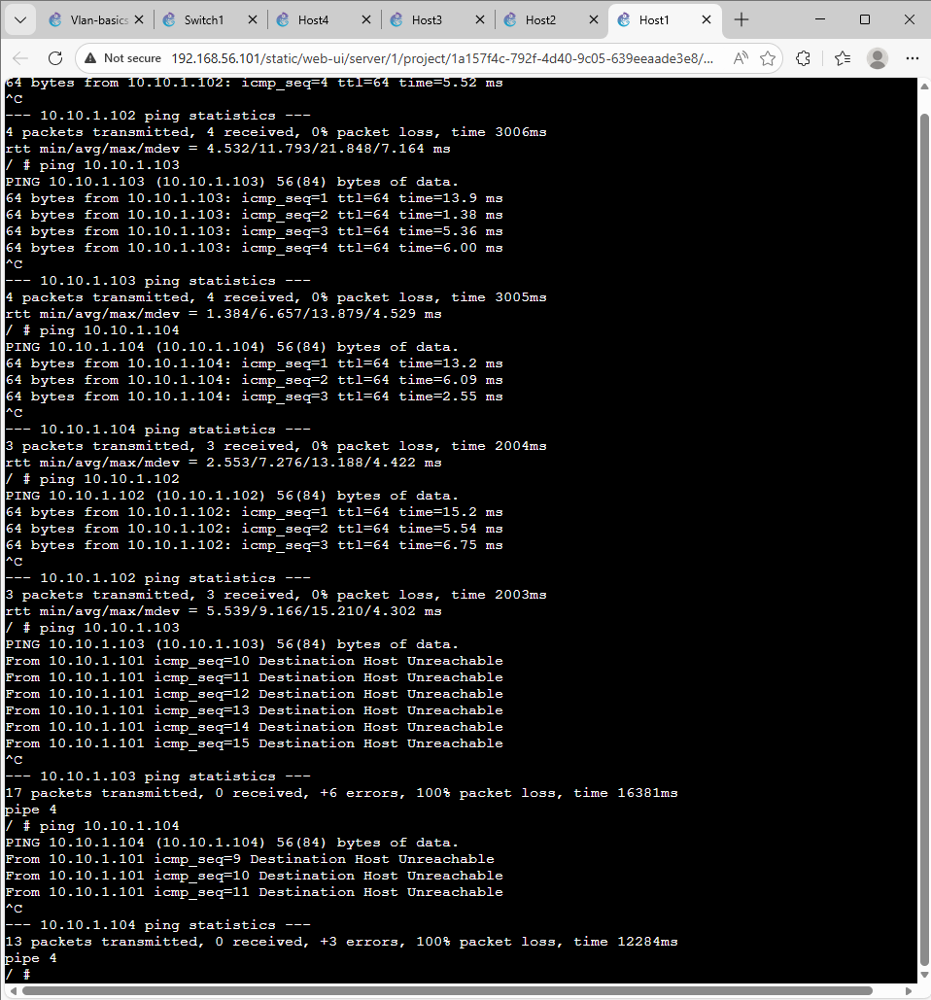

---
##  Output of ARP using `arp -n`


---

## Conclusion (Task 1)

VLAN is able to segregate traffic between groups.

---

#  Task 2: Inter-VLAN Routing

##  Network Topology of Inter-VLAN Routing:

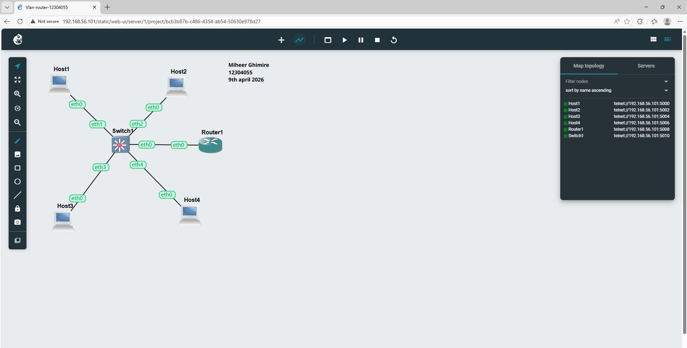

Switch to trunk link to router.

---

##  Configuration of Task 2

### VLAN Setup

```
ovs-vsctl set port eth1 tag=10
ovs-vsctl set port eth2 tag=10
ovs-vsctl set port eth3 tag=20
ovs-vsctl set port eth4 tag=20
```

---

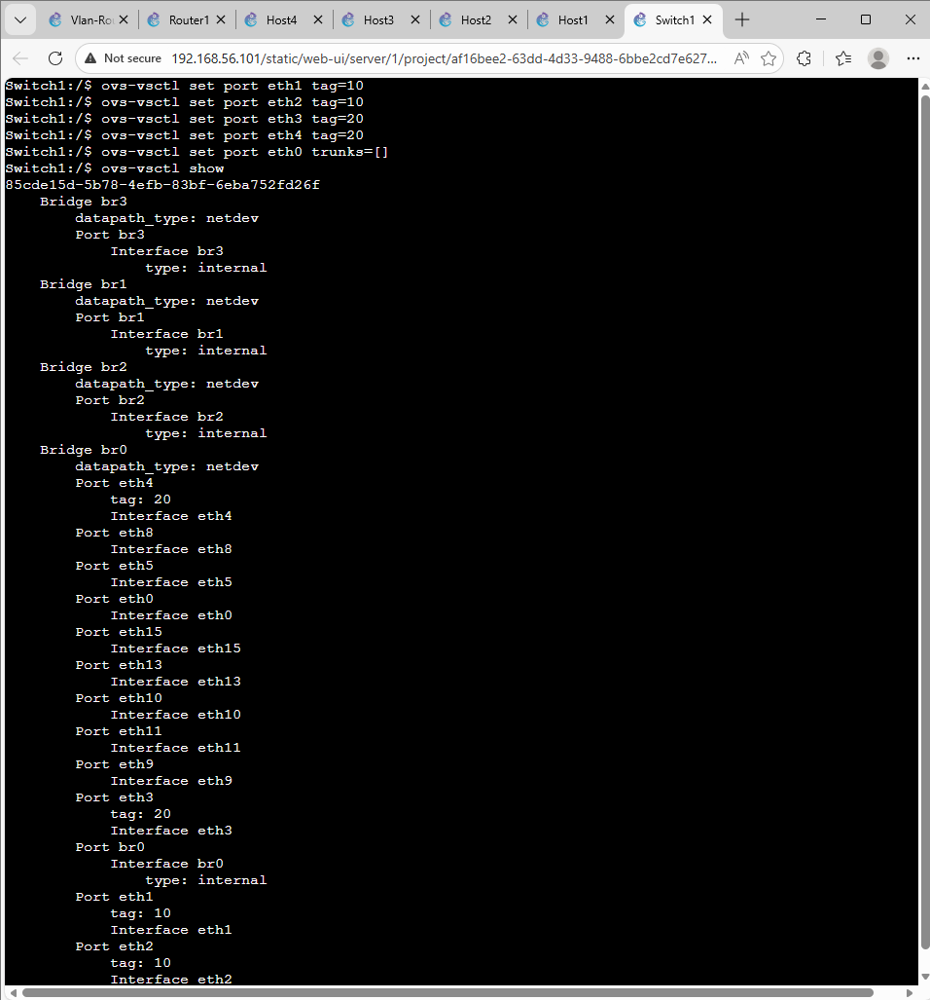

### Trunk Port

```
ovs-vsctl set port eth0 trunks=[]
```

It allows all VLAN traffic to router.

---

### Router Configuration of task 2:

```
ip link add link eth0 name eth0.10 type vlan id 10
ip link add link eth0 name eth0.20 type vlan id 20

ip addr add 10.10.1.1/24 dev eth0.10
ip addr add 10.10.2.1/24 dev eth0.20

ip link set eth0 up
ip link set eth0.10 up
ip link set eth0.20 up

echo 1 > /proc/sys/net/ipv4/ip_forward
```

---

##  IP Addressing of Task 2:

| Host  | IP Address  | VLAN |
| ----- | ----------- | ---- |
| Host1 | 10.10.1.101 | 10   |
| Host2 | 10.10.1.102 | 10   |
| Host3 | 10.10.2.103 | 20   |
| Host4 | 10.10.2.104 | 20   |

---

##  Week 5 Router Configuration Screenshot:


It shows VLAN interfaces and gateway setup.

---

##  Ping Connectivity Testing Screenshot: 


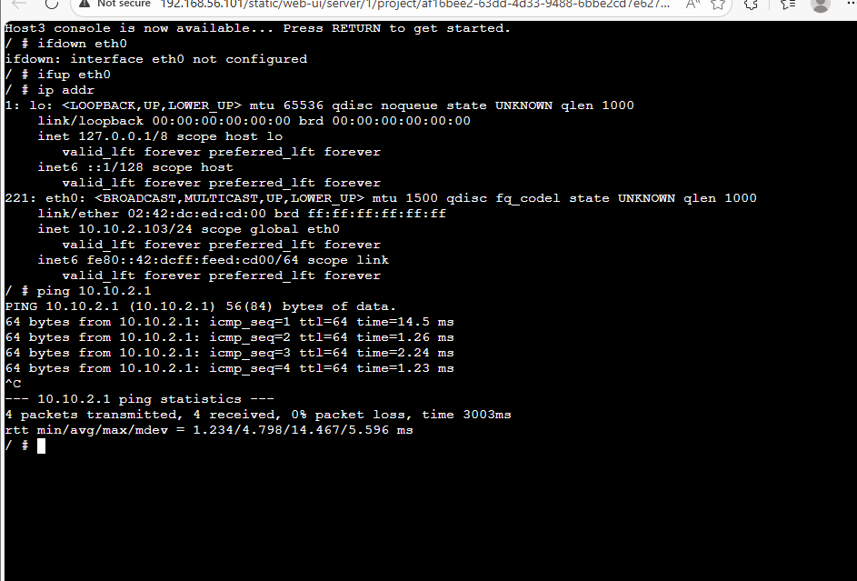


Inter-VLAN communication successful.

---
## Using WireShark in week 5: 
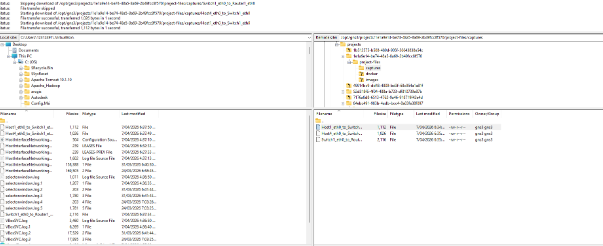


##  Conclusion (Task 2)

In task 2,  Linux router was able to support inter-VLAN routing. After configuring VLAN subinterfaces and enabling IP forwarding, devices from different VLANs were able to communicate, which demonstrated the significance of a router in bridging between different networks and proved that this setup was functioning properly.

---

#  Tools Used

* GNS3
* 4 hosts are used
* Used one Open vSwitch
* And also one Linux Router

---


## Final Summary

- VLANs helped me to learn how a network traffic, which can be isolated to enhance security and organization.  
- Trunk connections enabled the transmission of two or more VLANs in one connection between the devices.
- Router was significant to enable the communication between various VLANs.
- The network was built and tested successfully and everything went as planned.
