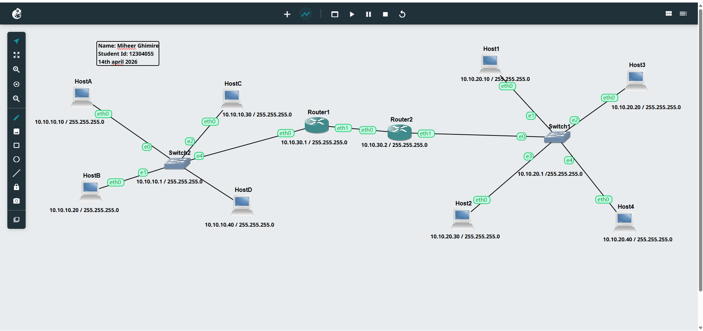
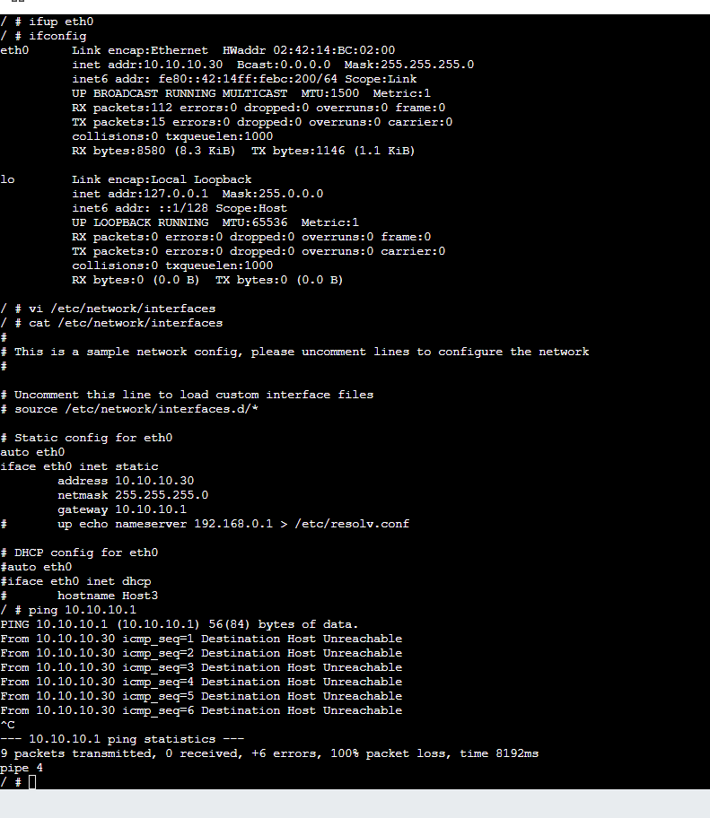
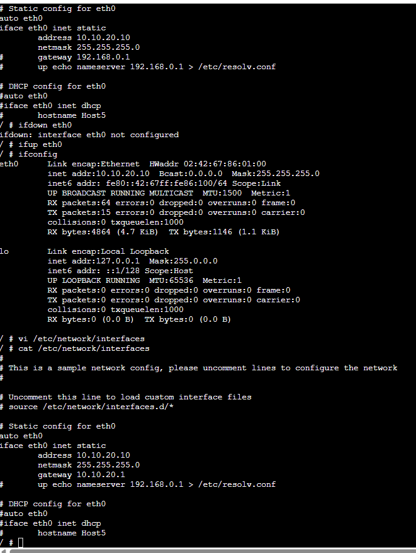
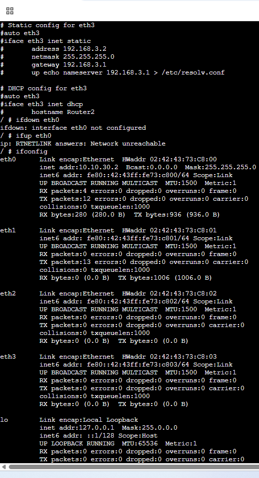
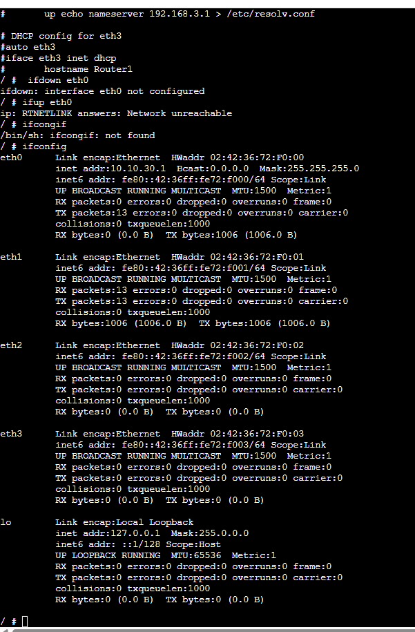
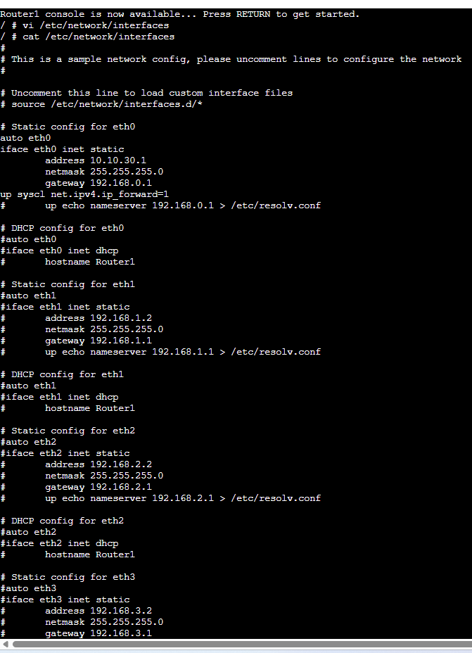

# WEEK 6 -Portfolio

## Course
**COIT12206 – TCP/IP Principles and Protocols**

## Student Details
- **Name:** Miheer Ghimire  
- **Student ID:** 12304055 
- **Term:** 2026 Term 1  

 
## Overview Of Week 6:

This sixth week was about ARP and simple address resolution in a routed network. It was a set of tasks to configure hosts and routers, verify interface settings, and test ping connectivity with ping command and ARP commands.
 
---
 
## Topology of week 6 –Address Resolution and Management:

 
Shown topology exhibits two LANs that are linked with the help of two routers, where Host A to Host D and Host 1 to Host 4 are found on the left and right sides respectively.
 
---
 
## Left LAN Host Configurations And Left LAN hosts with switch configurations:
 
### HostA Console:

 
HostA was set with a fixed IP address of 10.10.10.0/24 network and default route was Router1.
 
### HostB Console:

 
It was set to be on the same subnet as HostA but having a different host address.

 
### HostC Console:

 
HostC had a static IP address in the same left-side network and the same gateway.

 
### HostD

 
It was also configured in the 10.10.10.0/24 subnet.
 
---
 
## Right LAN Host Configurations 
 
### Host1 Console:

 
It was configured in the 10.10.20.0/24 network.
 
### Host2 Console:

 
Host2 was set to use a fixed IP in the same subnet as Host1.
 
### Host3 Console:

 
Host3 was set up in the right hand LAN and had Router 2 as the default gateway.
 
### Host4 Console:

 
Host4 was also configured in the same subnet and checked using interface commands.
 
---
 
## Router Configuration
 
### Router1 

 
Above Screenshot Shown, left LAN is connected to the inter-router network by Router1. IP forwarding was also turned on to allow the movement of packets across networks.
 

 
Screenshot of interface checking following configuration.
 
### Router2

 
Router2 links the inter- router network to the right LAN. And here also IP forwarding was enabled.
 

 
This is the active interface details after setup.
 
---
 
## Testing and Verification
 
The screen shots demonstrate interface checks with the help of the usage of ifconfig, connectivity checks with the help of ping, and ARP checking with the help of arp -a or similar commands. This aligns with the key concepts in the Week 6 lecture, where ARP is employed to assign IP addresses to MAC addresses within a local network prior to frame delivery:contentReference[oaicite:1]{index=1}
 
From the lecture, ARP is applied in situations where a device has the destination IP address yet it requires the corresponding MAC address on the LAN. The ARP request is sent into a broadcast and ARP reply is returned in the form of unicast.:contentReference[oaicite:2]{index=2}
 
---
 
## Result
Network devices were given a static IP address, routers were programmed to send packets and connectivity test was carried out to confirm that communication was working. Checks on ARP assisted in the verification of how devices found addresses on the local network.
